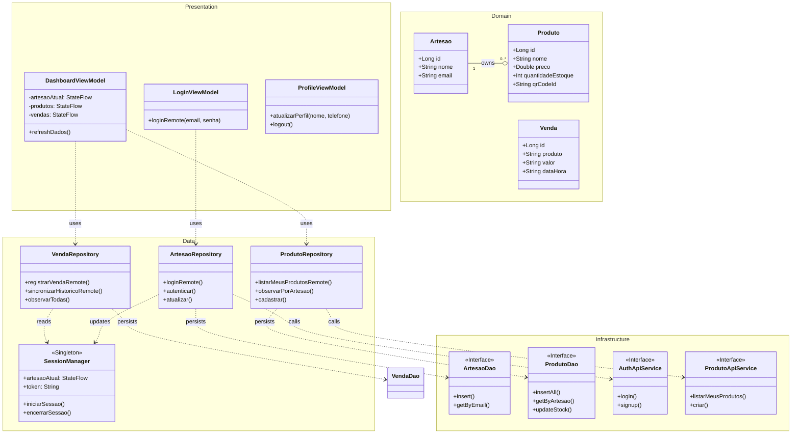
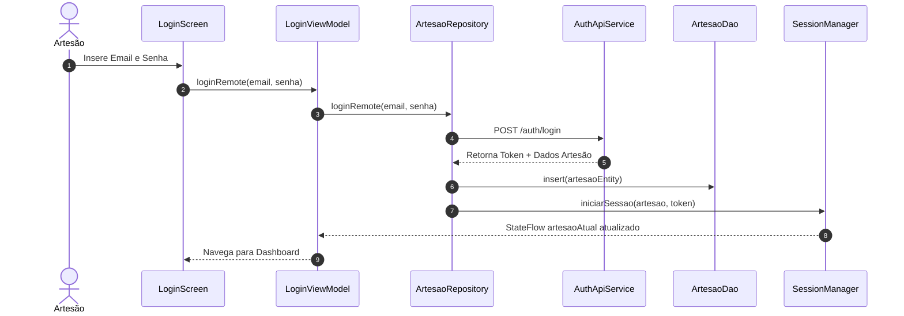
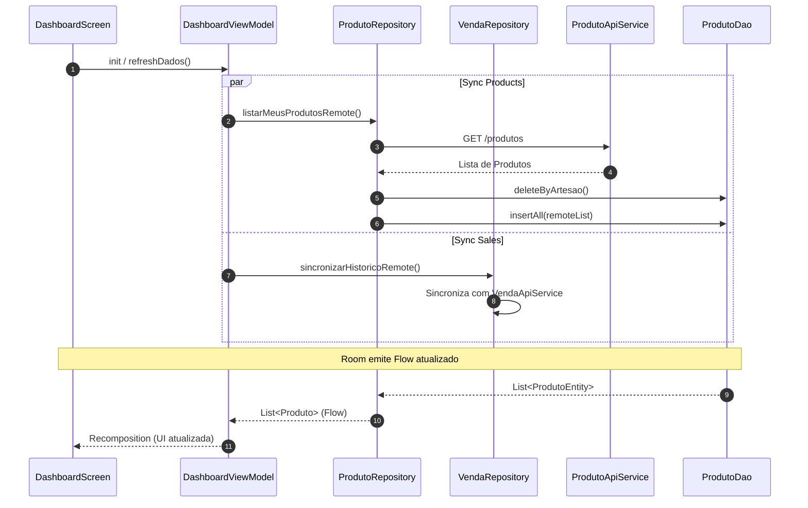
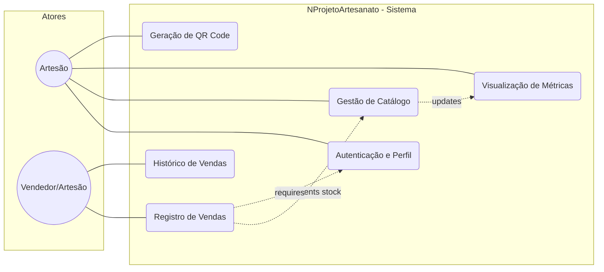

# Mermaid Diagrams - NProjetoArtesanato

This document contains the visual representation of the application's architecture and flows.

---

## 1. System Architecture (Class Diagram)

Describes the structure of the application, showing the relationships between UI components, repositories, local persistence (Room), and remote synchronization (Retrofit).

---

## 2. Authentication & Session Flow

Describes how a user logs in and how the session is established both locally and remotely.

---

## 3. Dashboard Data Sync Flow

Shows how the dashboard stays updated by fetching remote data and updating the local source of truth.

---

## 4. Sales Registration Flow

Details the process of recording a sale, involving stock update and persistence.

---

## 5. Use Case Overview

Summary of main interactions within the artisan management system.

