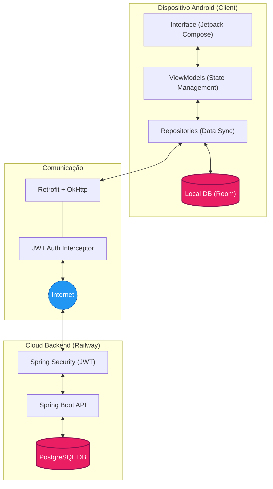
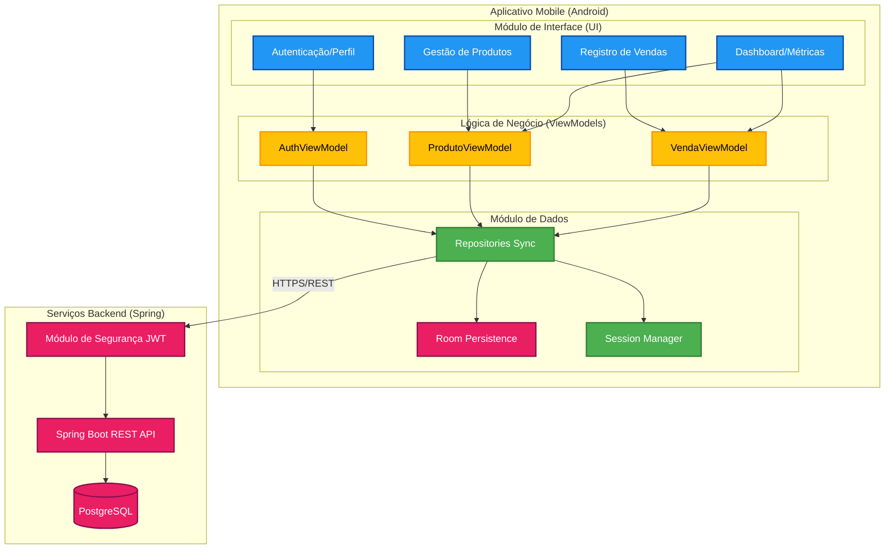
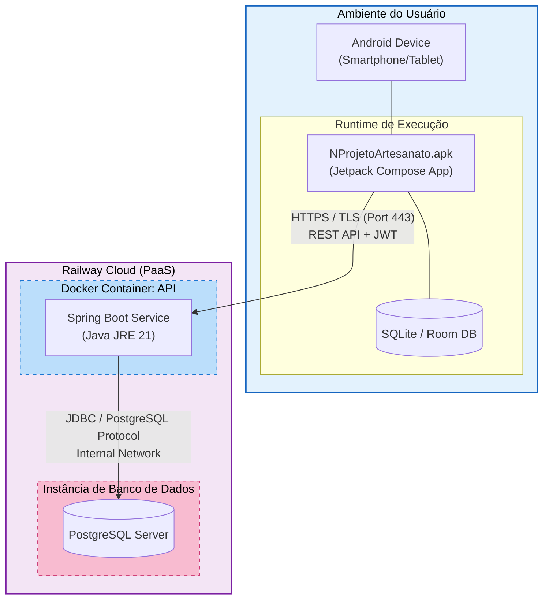
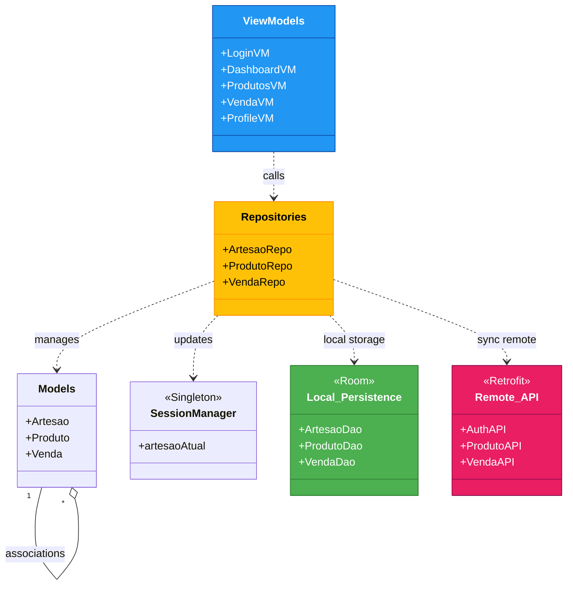
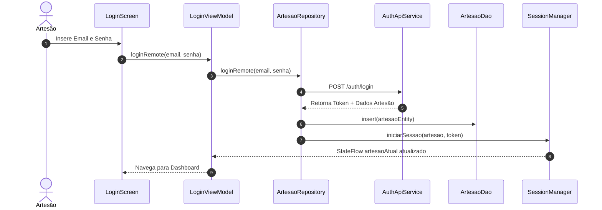
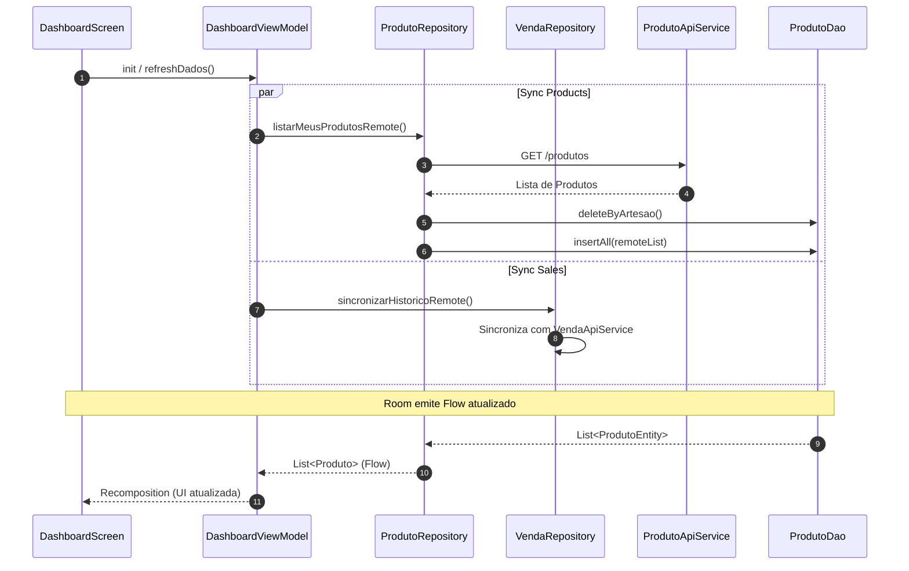
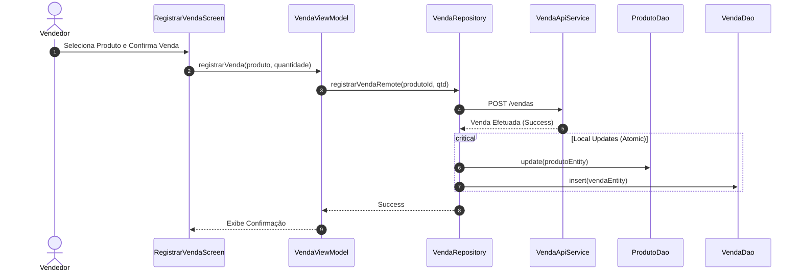
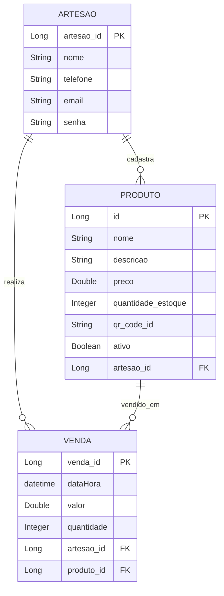
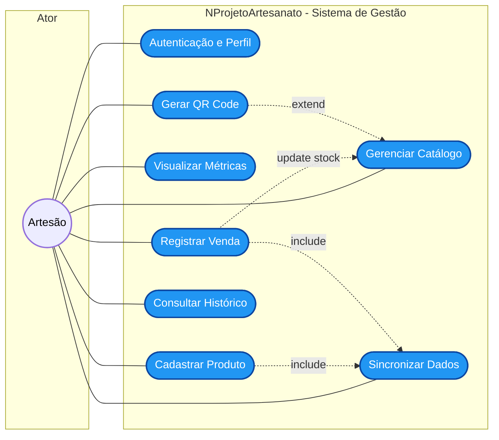

# Mermaid Diagrams - NProjetoArtesanato

This document contains the visual representation of the application's architecture and flows.

---

## 1. System Architecture Design

High-level overview of the system components, including the mobile client, local persistence, cloud-based backend, and authentication.

---

## 2. Component Diagram

Visualizes the functional modules of the system, their responsibilities, and how they interact through defined interfaces and services.

---

## 3. Deployment Diagram

Illustrates the physical deployment of the system, showing where the components are executed and how they communicate across different environments.

---

## 4. System Architecture (Class Diagram - Compact)

Simplified view focusing on dependencies and core logic. Metadata and trivial fields are hidden to improve readability.

### Complete

```mermaid
classDiagram
    direction TB

    %% Presentation Layer
    namespace Presentation {
        class LoginViewModel {
            +loginRemote(email, senha)
        }
        class CadastroArtesaoViewModel {
            +signupRemote(dto)
        }
        class DashboardViewModel {
            -artesaoAtual: StateFlow
            -produtos: StateFlow
            -vendas: StateFlow
            +refreshDados()
        }
        class ProdutosViewModel {
            -produtos: StateFlow
            +deletarProduto(id)
        }
        class CadastroProdutoViewModel {
            +cadastrarRemote(dto)
        }
        class VendaViewModel {
            -vendas: StateFlow
            +registrarVendaRemote(produtoId, qtd)
        }
        class ProfileViewModel {
            +atualizarPerfil(nome, telefone)
            +logout()
        }
    }

    %% Domain Layer (Models)
    namespace Domain {
        class Artesao {
            +Long id
            +String nome
            +String telefone
            +String email
            +String senha
        }
        class Produto {
            +Long id
            +String nome
            +String descricao
            +Double preco
            +Int quantidadeEstoque
            +String qrCodeId
            +Boolean ativo
            +Long artesaoId
        }
        class Venda {
            +Long id
            +String produto
            +String artesao
            +Long artesaoId
            +String vendedor
            +String valor
            +Int quantidade
            +String dataHora
        }
    }

    %% Data Layer (Repositories & Session)
    namespace Data {
        class ArtesaoRepository {
            +loginRemote()
            +autenticar()
            +atualizar()
        }
        class ProdutoRepository {
            +listarMeusProdutosRemote()
            +observarPorArtesao()
            +cadastrar()
        }
        class VendaRepository {
            +registrarVendaRemote()
            +sincronizarHistoricoRemote()
            +observarTodas()
        }
        class SessionManager {
            <<Singleton>>
            +artesaoAtual: StateFlow
            +token: String
            +iniciarSessao()
            +encerrarSessao()
        }
    }

    %% Infrastructure (Room & Retrofit)
    namespace Infrastructure {
        class ArtesaoDao {
            <<Interface>>
            +insert(artesao)
            +getByEmail(email)
        }
        class ProdutoDao {
            <<Interface>>
            +insertAll(list)
            +getByArtesao(id)
            +update(produto)
        }
        class VendaDao {
            <<Interface>>
            +insert(venda)
            +getAll()
        }
        class AuthApiService {
            <<Interface>>
            +login(request)
            +signup(dto)
        }
        class ProdutoApiService {
            <<Interface>>
            +listarMeusProdutos()
            +criar(dto)
        }
        class VendaApiService {
            <<Interface>>
            +registrar(request)
            +listarMinhasVendas()
        }
    }

    %% Relationships
    LoginViewModel ..> ArtesaoRepository : uses
    CadastroArtesaoViewModel ..> ArtesaoRepository : uses
    DashboardViewModel ..> ProdutoRepository : uses
    DashboardViewModel ..> VendaRepository : uses
    ProdutosViewModel ..> ProdutoRepository : uses
    CadastroProdutoViewModel ..> ProdutoRepository : uses
    VendaViewModel ..> VendaRepository : uses
    ProfileViewModel ..> ArtesaoRepository : uses
    
    ArtesaoRepository ..> AuthApiService : calls
    ArtesaoRepository ..> ArtesaoDao : persists
    ArtesaoRepository ..> SessionManager : updates

    ProdutoRepository ..> ProdutoApiService : calls
    ProdutoRepository ..> ProdutoDao : persists

    VendaRepository ..> VendaApiService : calls
    VendaRepository ..> VendaDao : persists
    VendaRepository ..> ProdutoDao : updates stock
    VendaRepository ..> SessionManager : reads

    Artesao "1" --o "0..*" Produto : owns
    Produto "1" --o "0..*" Venda : sold in
    Artesao "1" --o "0..*" Venda : performs
```

### Compacted

---

## 5. Authentication & Session Flow

Describes how a user logs in and how the session is established both locally and remotely.

---

## 6. Dashboard Data Sync Flow

Shows how the dashboard stays updated by fetching remote data and updating the local source of truth.

---

## 7. Sales Registration Flow

Details the process of recording a sale, involving stock update and persistence.

---

## 8. Entity-Relationship Diagram (ER Diagram)

This diagram represents the database schema of the Spring Boot backend, updated to reflect the Artisan as the primary actor for all operations (including Sales).

---

## 9. Use Case Diagram (UML Standard)

This diagram describes the functional requirements and the interaction between the primary actor (Artisan) and the system.

