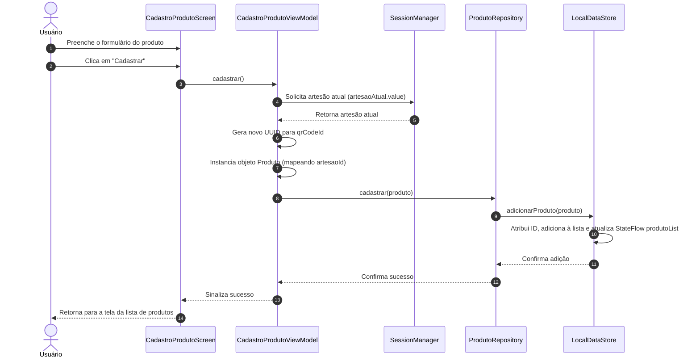
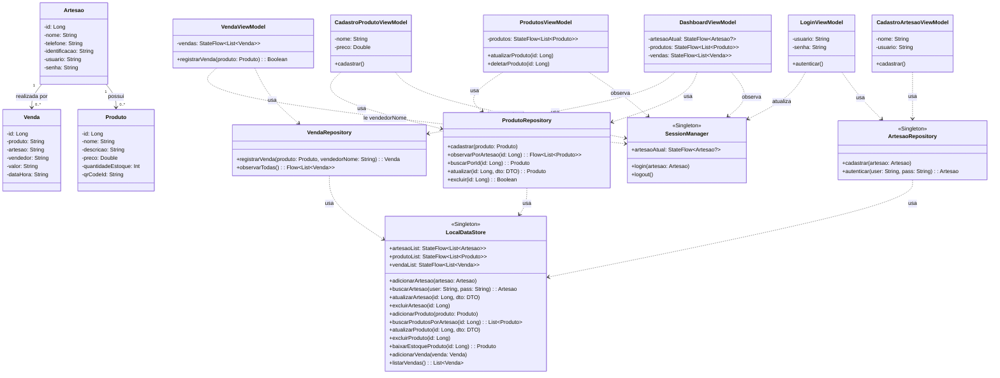
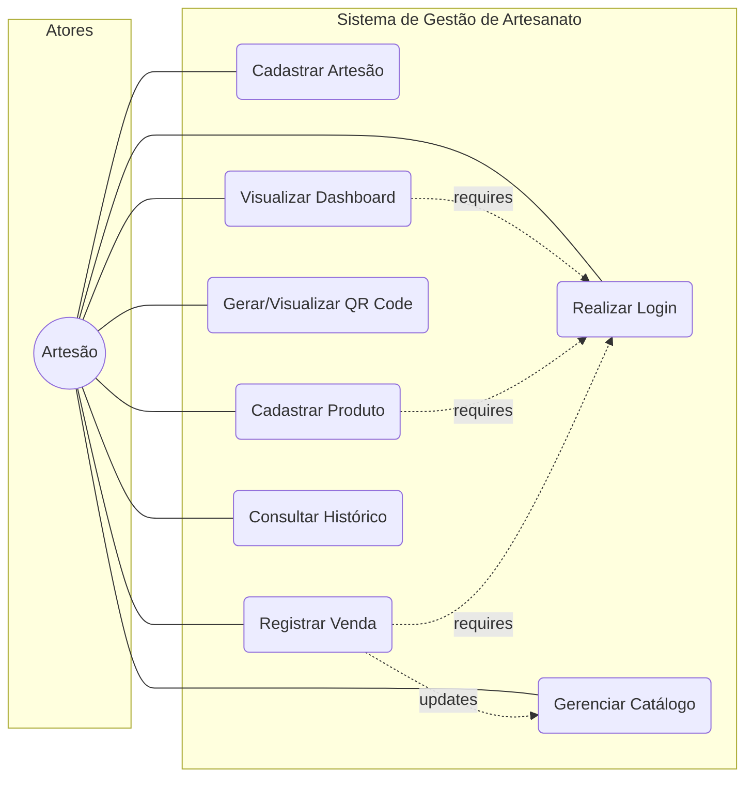

```mermaid
sequenceDiagram
    autonumber
    actor User as Usuário
    participant Screen as CadastroProdutoScreen
    participant VM as CadastroProdutoViewModel
    participant Session as SessionManager
    participant Repo as ProdutoRepository
    participant Store as LocalDataStore

    User->>Screen: Preenche o formulário do produto
    User->>Screen: Clica em "Cadastrar"
    Screen->>VM: cadastrar()
    
    VM->>Session: Solicita artesão atual (artesaoAtual.value)
    Session-->>VM: Retorna artesão atual
    
    VM->>VM: Gera novo UUID para qrCodeId
    VM->>VM: Instancia objeto Produto (mapeando artesaoId)
    
    VM->>Repo: cadastrar(produto)
    Repo->>Store: adicionarProduto(produto)
    
    Store->>Store: Atribui ID, adiciona à lista e atualiza StateFlow produtoList
    Store-->>Repo: Confirma adição
    Repo-->>VM: Confirma sucesso
    
    VM-->>Screen: Sinaliza sucesso
    Screen-->>User: Retorna para a tela da lista de produtos
```

```mermaid
classDiagram
    direction TB

    %% Model Layer
    class Artesao {
        -id: Long
        -nome: String
        -telefone: String
        -identificacao: String
        -usuario: String
        -senha: String
    }

    class Produto {
        -id: Long
        -nome: String
        -descricao: String
        -preco: Double
        -quantidadeEstoque: Int
        -qrCodeId: String
    }

    class Venda {
        -id: Long
        -produto: String
        -artesao: String
        -vendedor: String
        -valor: String
        -dataHora: String
    }

    %% Data Layer
    class LocalDataStore {
        <<Singleton>>
        +artesaoList: StateFlow~List~Artesao~~
        +produtoList: StateFlow~List~Produto~~
        +vendaList: StateFlow~List~Venda~~
        +adicionarArtesao(artesao: Artesao)
        +buscarArtesao(user: String, pass: String): Artesao
        +atualizarArtesao(id: Long, dto: DTO)
        +excluirArtesao(id: Long)
        +adicionarProduto(produto: Produto)
        +buscarProdutosPorArtesao(id: Long): List~Produto~
        +atualizarProduto(id: Long, dto: DTO)
        +excluirProduto(id: Long)
        +baixarEstoqueProduto(id: Long): Produto
        +adicionarVenda(venda: Venda)
        +listarVendas(): List~Venda~
    }

    class SessionManager {
        <<Singleton>>
        +artesaoAtual: StateFlow~Artesao?~
        +login(artesao: Artesao)
        +logout()
    }

    %% Repository Layer
    class ArtesaoRepository {
        <<Singleton>>
        +cadastrar(artesao: Artesao)
        +autenticar(user: String, pass: String): Artesao
    }

    class ProdutoRepository {
        +cadastrar(produto: Produto)
        +observarPorArtesao(id: Long): Flow~List~Produto~~
        +buscarPorId(id: Long): Produto
        +atualizar(id: Long, dto: DTO): Produto
        +excluir(id: Long): Boolean
    }

    class VendaRepository {
        +registrarVenda(produto: Produto, vendedorNome: String): Venda
        +observarTodas(): Flow~List~Venda~~
    }

    %% ViewModel Layer
    class LoginViewModel {
        -usuario: String
        -senha: String
        +autenticar()
    }

    class CadastroArtesaoViewModel {
        -nome: String
        -usuario: String
        +cadastrar()
    }

    class DashboardViewModel {
        -artesaoAtual: StateFlow~Artesao?~
        -produtos: StateFlow~List~Produto~~
        -vendas: StateFlow~List~Venda~~
    }

    class ProdutosViewModel {
        -produtos: StateFlow~List~Produto~~
        +atualizarProduto(id: Long)
        +deletarProduto(id: Long)
    }

    class CadastroProdutoViewModel {
        -nome: String
        -preco: Double
        +cadastrar()
    }

    class VendaViewModel {
        -vendas: StateFlow~List~Venda~~
        +registrarVenda(produto: Produto): Boolean
    }

    %% Relationships
    Artesao "1" --> "0..*" Produto : possui
    Artesao "1" --> "0..*" Venda : realizada por
    
    ArtesaoRepository ..> LocalDataStore : usa
    ProdutoRepository ..> LocalDataStore : usa
    VendaRepository ..> LocalDataStore : usa
    
    LoginViewModel ..> ArtesaoRepository : usa
    LoginViewModel ..> SessionManager : atualiza
    
    CadastroArtesaoViewModel ..> ArtesaoRepository : usa

    DashboardViewModel ..> SessionManager : observa
    DashboardViewModel ..> ProdutoRepository : usa
    DashboardViewModel ..> VendaRepository : usa

    ProdutosViewModel ..> SessionManager : observa
    ProdutosViewModel ..> ProdutoRepository : usa

    CadastroProdutoViewModel ..> SessionManager : le artesaoAtual
    CadastroProdutoViewModel ..> ProdutoRepository : usa
    
    VendaViewModel ..> VendaRepository : usa
    VendaViewModel ..> SessionManager : le vendedorNome
```

```mermaid
graph LR
    subgraph Atores
        Artesao((Artesão))
    end

    subgraph "Sistema de Gestão de Artesanato"
        UC1(Cadastrar Artesão)
        UC2(Realizar Login)
        UC3(Visualizar Dashboard)
        UC4(Cadastrar Produto)
        UC5(Gerenciar Catálogo)
        UC6(Gerar/Visualizar QR Code)
        UC7(Registrar Venda)
        UC8(Consultar Histórico)
    end

    Artesao --- UC1
    Artesao --- UC2
    Artesao --- UC3
    Artesao --- UC4
    Artesao --- UC5
    Artesao --- UC6
    Artesao --- UC7
    Artesao --- UC8

    UC3 -.->|requires| UC2
    UC4 -.->|requires| UC2
    UC7 -.->|requires| UC2
    UC7 -.->|updates| UC5
```

