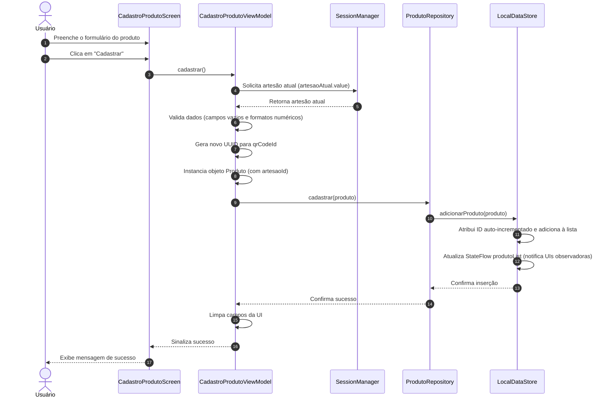

```mermaid
sequenceDiagram
    autonumber
    actor User as Usuário
    participant Screen as CadastroProdutoScreen
    participant VM as CadastroProdutoViewModel
    participant Session as SessionManager
    participant Repo as ProdutoRepository
    participant Store as LocalDataStore

    User->>Screen: Preenche o formulário do produto
    User->>Screen: Clica em "Cadastrar"
    Screen->>VM: cadastrar()
    
    VM->>Session: Solicita artesão atual (artesaoAtual.value)
    Session-->>VM: Retorna artesão atual
    
    VM->>VM: Valida dados (campos vazios e formatos numéricos)
    VM->>VM: Gera novo UUID para qrCodeId
    VM->>VM: Instancia objeto Produto (com artesaoId)
    
    VM->>Repo: cadastrar(produto)
    Repo->>Store: adicionarProduto(produto)
    
    Store->>Store: Atribui ID auto-incrementado e adiciona à lista
    Store->>Store: Atualiza StateFlow produtoList (notifica UIs observadoras)
    Store-->>Repo: Confirma inserção
    Repo-->>VM: Confirma sucesso
    
    VM->>VM: Limpa campos da UI
    VM-->>Screen: Sinaliza sucesso
    Screen-->>User: Exibe mensagem de sucesso
```

